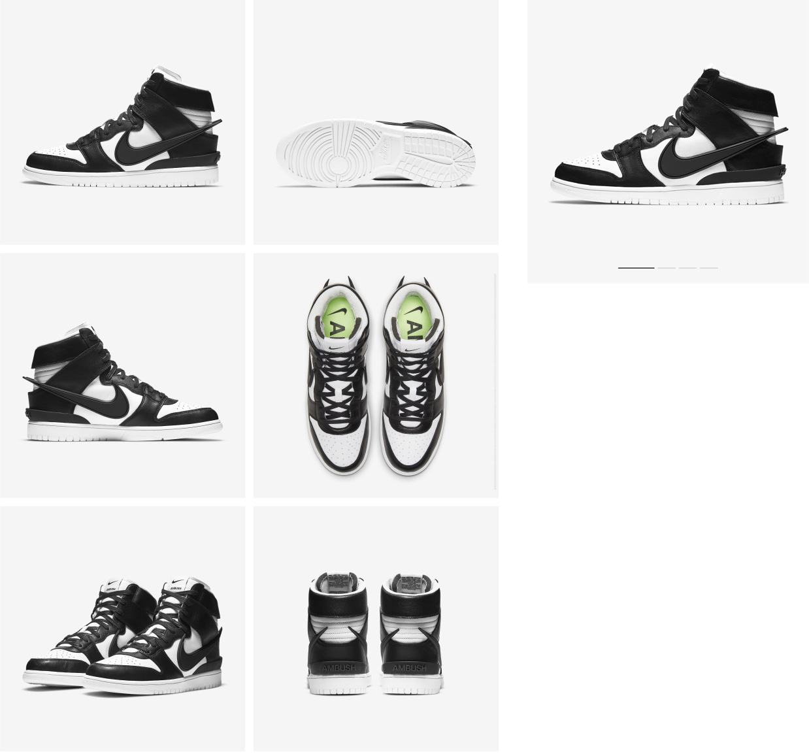
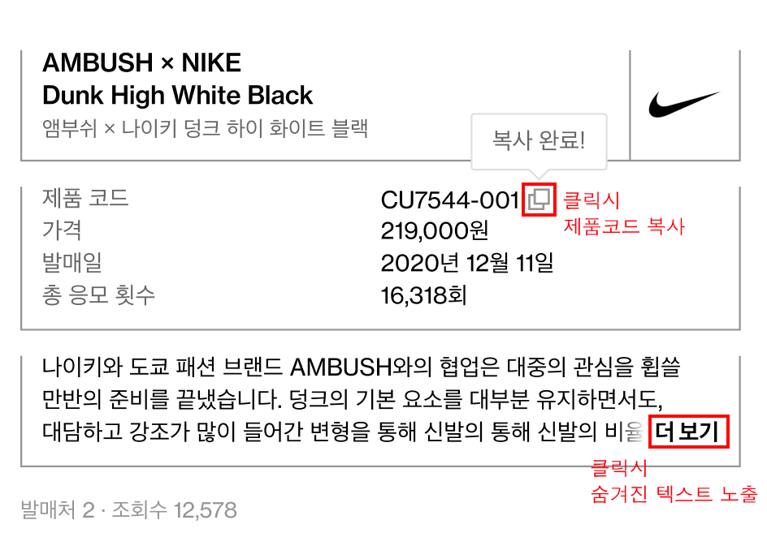
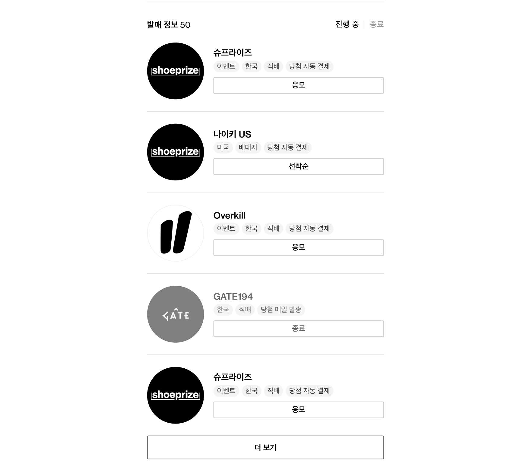
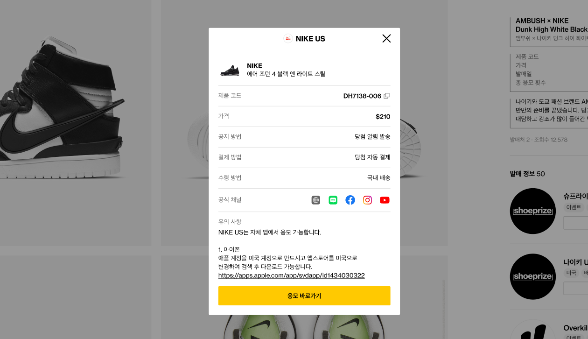

#### 1. 테스트 진행 일자

2022년 10월 19일(수) ~ 2022년 10월 26(수)

<br><br>

#### 2. 개발 환경 및 제약사항

1. React 혹은 NextJS 로 제작해 주세요. (Typescript 사용 시 우대)
2. API는 공유받은 git clone 후 static 경로에 있는 자원 사용해주세요.
3. API에 대한 상세 정보는 아래 링크 확인 부탁드립니다.<br>
   API 상세정보 링크 - [api상세정보](./api상세정보.md)
4. 플러그인을 활용해도 좋고 자신만의 코드를 추가해도 좋습니다.
5. 디자인 공유는 Figma로 공유해 드립니다. Figma 로그인하고 사용하시면 수치 값 확인하실 수 있습니다.<br>
   Figma 링크 - [shorturl.at/alsU2](shorturl.at/alsU2)

<br>
<br>

#### 3. 제출안내

1. 과제는 압축해서 "슈프라이즈지원_지원자 이름" zip 파일로 공유해 주세요.
2. 제출 마감 시간을 넘기면 채점 대상에서 제외됩니다. 완성되지 않더라도 꼭 마감 시간을 지켜 주세요.

<br>
<br>

#### 4. 테스트 문제

1. Figma로 공유해 드린 슈프라이즈 상품 상세 모바일, PC 반응형 디자인 컴포넌트를 제작해주세요.

   ```
   요청사항 
   1. PC해상도 너비1440이상으로 작업해주시면 됩니다.
   ```

   <br><br>

2. 상품 썸네일 이미지 영역 

   

   ```
   요청사항
   1. API - static/product/id/413.json images값 사용해주세요.
   ```
   
   <br><br>
   
3. 상품정보 영역 
   

```
요청사항 
1. API - static/product/id/413.json
2. 제품 코드 옆 아이콘 클릭 시 제품 코드 복사됩니다. 
3. "더보기" 클릭시 숨겨진 텍스트 노출 
```

<br><br>

4. 발매정보
   

```
요청사항

1. API - static/releases/413.json
2. 응모 종료 시간을 현재시간과 비교하여 진행 중, 종료 탭으로 구분해주세요.
3. 발매정보 5개 초과인 경우 더 보기 버튼 노출, 더보기 버튼 클릭 시 발매정보 5개씩 노출
4. 버튼은 선착순, 응모, 종료 3가지 케이스로 노출해주세요.
	 선착순 - 종료되지 않은 선착순 상품 
	 응모 - 종료되지 않은 응모 상품
	 종료 - 종료된 선착순, 응모 상품
```

<br><br>

5. 발매정보 레이어 
   

   ``` 
   요청사항
   1. API - 발매정보 uuid사용하여 호출합니다. static/product_release/{uuid}.json
   2. 발매정보 응모, 선착순, 종료 버튼 클릭 시 레이어 활성화
   3. 레이어 내 "응모 바로가기", "선착순 구매하기", "종료" 클릭 시 응모url로 이동됩니다. 
   ```

   
